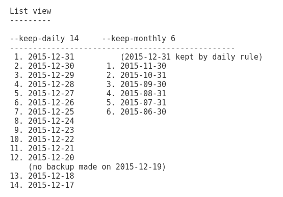

#     Резервное копирование

## 1. ДЗ

####Задание:

1. Настроить стенд Vagrant с двумя виртуальными машинами: backup_server и client

2. Настроить удаленный бекап каталога /etc c сервера client при помощи borgbackup. Резервные копии должны соответствовать следующим критериям:

      - Директория для резервных копий /var/backup. Это должна быть отдельная точка монтирования. В данном случае для демонстрации размер не принципиален, достаточно будет и 2GB.
      - Репозиторий для резервных копий должен быть зашифрован ключом или паролем - на ваше усмотрение
      - Имя бекапа должно содержать информацию о времени снятия бекапа
      - Глубина бекапа должна быть год, хранить можно по последней копии на конец месяца, кроме последних трех. Последние три месяца должны содержать копии на каждый день. Т.е. должна быть правильно настроена политика удаления старых бэкапов
      - Резервная копия снимается каждые 5 минут. Такой частый запуск в целях демонстрации.
      - Написан скрипт для снятия резервных копий. Скрипт запускается из соответствующей Cron джобы, либо systemd timer-а - на ваше усмотрение.
      - Настроено логирование процесса бекапа. Для упрощения можно весь вывод перенаправлять в logger с соответствующим тегом. Если настроите не в syslog, то обязательна ротация логов
      Запустите стенд на 30 минут. Убедитесь что резервные копии снимаются. Остановите бекап, удалите (или переместите) директорию /etc и восстановите ее из бекапа. Для сдачи домашнего задания ожидаем настроенные стенд, логи процесса бэкапа и описание процесса восстановления.

___

####Решение:

Развернём с помощью vagrant-a две виртуальные машины (srvbaсkup и client), одна будет выступать как сервер бэкапов (srvbaсkup), другая - клиент (client), с неё будем копировать на сервер данные. При старте Vagrantfile, разворачиваются 2 виртуальных машины, сервер и клиент, на сервере создаётся выделенный раздел с точкой монтирования (/var/backup) и выделенный пользователь borg, копируется открытый ключ с клиента, под пользователя borg, для возможности создания резервных копий (РК). На клиенте запуск скрипта архивирования происходит под root пользователем, для получения полного доступа ко всем папкам и файлам системы. Преодичность старта скрипта выставлена через systemd.timer, равна 5 минутам. В скрипте настроена очистка содержимого архивного репозитория, по заданным критериям (дополнительно стоит --keep-minutely 5   --keep-last 2 ---  хранить пять  минутных архива + 2 последних  ).

[Vagrant файл для выполнения задания](Vagrantfile)  
[Скрипт для запуска на сервере](srvbackup.sh)  
[Скрипт для запуска на клиенте](client.sh)  
[Сервис для systemd, для запуска systemd timer-a](borg_backup.service)  
[Таймер для systemd, для запуска timer-a](borg_backup.timer)  
[Скрипт запуска архивирования по расписанию через systemd.timer](borg_backup.sh)

**Для работы скрипта архивирования, обязательно настроить SELinux :) !!!!**

___

##### 1. Работа с системой архивирования borg

>Для CentOS 7/8 приложение доступно в EPEL репозитарии:

            yum -y install epel-release
            yum -y install borgbackup

___

**BorgBackup** — это приложение для резервного копирования файлов с поддержкой дедупликации.

Основные возможности:

- **_Эффективное хранение_**.  
    Каждый файл разбивается на порции (chunks) и добавляется в репозиторий резервных копий если его там ещё не присутствовало.

- **_Скорость работы_**.  
    Приложение написано на Python, но критические участки реализованы на C/Python. Используется кэширование и индексирование данных.

- **_Поддержка сжатия_**.  
    Поддерживаются четыре вида сжатия данных: lz4, zstd, zlib и lzma.

- **_Поддержка шифрования_**.  
    Данные можно зашифровать с помощью 256-битного AES, целостность данных проверяется с помощью HMAC-SHA256.

##### Полезные ключи, команды, переменные

Экпорт переменных:

>если используется нестандартный SSH-ключ, по умолчанию id_rsa,то его надо явно указать:  
**export BORG_RSH="ssh -i /home/userXY/.ssh/id_ed25519**
___

>Переменная окружения, с именем репозитория, можно сократить команды создания, просмотра, информации:  
**export BORG_REPO=borg@192.168.10.11:backup**
___

>Пароль репозитория Borg можно указать в переменной окружения (BORG_PASSPHRASE), чтобы не вводить его при каждом запуске:  
**export BORG_PASSPHRASE='vagrant'**
___

>Автоответ, если вариант подключения к репозиторию изменился был - (borg@192.168.10.11:backup) переключили на  (ssh://borg@192.168.10.11:44235/var/backup/client/backup), появится предупреждение “Warning: The repository at location … was previously located at …”
**export BORG_RELOCATED_REPO_ACCESS_IS_OK=yes**

___

>Автответ на потенциально опасные действия
**export BORG_CHECK_I_KNOW_WHAT_I_AM_DOING=yes**

___

>Автответ при запросе об удалении репозитрия со всем содержимым
**export BORG_DELETE_I_KNOW_WHAT_I_AM_DOING=yes**

Borg использует понятие репозитория — это хранилище резервных копий.
1. Инициализируем репозиторий (bakup):

    **borg init** --encryption=repokey-blake2 borg@192.168.10.11:backup

>**альтернативный вариант указания удалённого репозотория с нестандартным портом для ssh** :
>    ssh://user@host:port/path/to/repo  
>    **export BORG_REPO=ssh://borg@192.168.10.11:44235/var/backup/client/backup** <---- Указывается полный путь к репозиторию (/var/backup/client/backup)

После того как репозиторий создан, можно добавлять в него файлы и папки командой create. Внутри каждого репозитария может храниться множество архивов. При создании, просто указываем имя создаваемого архива  '{hostname}_etc-daily-{now}'
Перед первым созданием архивных копий, рекомндуется создать небольшой резерв свободного места в репозитории (  borg config /path/to/repo additional_free_space 2G), это необходимо, если произойдёт нехватка свободного места, то чтоб очистить архив от старых архивов, нужно свободное место, для этого и будет задействован резерв. Создаётся локально в репозитории.
Т.е зайдём на сервер бэкапов srvbackup, и в папке  созданного репозитория запустим команду:

      borg config /var/backup/client/backup/ additional_free_space 100M

___

2. Добавляем в созданный репозиторий архив с  каталогами для архивирования, например "/etc", можно через пробел список каталогов:

    **borg create**   --list --stats --show-rc --filter AME --compression zlib,5  --exclude-caches  borg@192.168.10.11:backup::'{hostname}_etc-daily-{now}' /etc

       {hostname}_etc-daily-{now} - имя архива
       --stats - показывать статистику
       --list - вывод имен всех файлов создаваемого бэкапа
       --compression zlib,5 - использовать сжатие, библиотека zlib, уровень сжатия 5
       --show-rc - печатать код возврата
       --exclude-caches  - исключить директории содержащие файл CACHEDIR.TAG
       --exclude - исключить определённые каталоги из списка архивирования, если архивируется, например, вся Linux система
       --filter AME - Архивировать только новые или изменённые файлы, которые не архивировались в предыдущий раз.

___

3. Вывод списка архивов в выбранном репозитории:

    **borg list**  borg@192.168.10.11:backup

___

4. Просмотр список файлов  в репозитории, в выбранном архиве '{hostname}_etc-daily-{now}'

    **borg list**  borg@192.168.10.11:backup::'{hostname}_etc-daily-{now}'

___

5. Посмотреть общую информацию о репозитории:

    **borg info** borg@192.168.10.11:backup

___

6. Команда экспорта ключа для зашифрованного репозитория, сохранить в отдельном месте, для восстановления доступа. Пароль тоже нужен :)

    **borg key export** borg@192.168.10.11:backup ~/borg-srvbackup.key

___

7. Восстановить файл или каталог из бэкапа:

    **borg extract** borg@192.168.10.11:backup::'{hostname}_etc-daily-{now}' etc/hosts <---- только файл
        borg extract borg@192.168.10.11:backup::'{hostname}_etc-daily-{now}' etc/      <---- весь каталог  
Восстанавливается в текущий каталог, где находитесь в момент запуска команды.

___

8. Проверка репоитория и содержащихся в нём архивов:

    **borg check** -v borg@192.168.10.11:backup

___

9. Создание tar архива из существующих архивов в репозитории:

    **borg export-tar**  borg@192.168.10.11:backup::‘client_etc-daily-2021-04-16T10:05:37’ ./etc.tar

___

#####Политика хранения копий

Для настройки того сколько и каких копий будет хранить borg мы использовали
опции, с которыми вызывалась команда prune.
Рассмотрим возможные опции подробнее

- --keep-within INTERVAL	храним все архивы в течение указанного промежутка времени
- --keep-last     сколько последних копий хранить
- --keep-secondly 	сколько посекундных архивов хранить
- --keep-minutely 	сколько поминутных архивов хранить
- -H, --keep-hourly 	сколько почасовых архивов хранить
- -d, --keep-daily 	сколько ежедневных архивов хранить
- -w, --keep-weekly 	сколько еженедельных архивов хранить
- -m, --keep-monthly 	сколько ежемесячных архивов хранить
- -y, --keep-yearly 	сколько ежегодных архивов хранить

Команда prune удалит архивы, которые не попали под указанные опции.
Опция --keep-within принимает аргумент вида "<int><char>", где char-это "H",
"d", "w", "m", "y". Например, --keep-within 2d означает, что все архивы,
созданные за последние 48 часов удалять нельзя. "1m" означает "31d". Архивы,
попадающие под этот шаблон, не учитываются в других опциях при построении
списка сохраняемых архивов.

Настроим всё так, чтобы хранить последние 93 копий с интервалом в день, 12 копий с интервалом в неделю и 12 копий с интервалом в месяц.

Пример опций хранения архивов:

    --keep-daily 93   <---- **Храним 93 копии с интервалом в день, что = 1 копии за каждый день за период 3 месяца, при условии запуска скрипта архивирования не реже 1 раз в день, иначе будут хранится 93 копии, с интервалом 1 день и больше, но именно 93 копии.**

    --keep-weekly 12  <---- **Храним по одно копии с интервалом неделя, что = 1 копия за каждую неделю на протяжении 3 месяцев, при условии запуска скрипта архивирования не реже 1 раза в неделю. Хранится будет 12 копий, даже если интервал запуска больше недели**

    --keep-monthly 12 <---- **Храним 12 копий с интервалом 1 месяц и больше, т.е по 1 копии каждый месяц, если запуск скрипта архивирования происходит не реже 1 раза в месяц - это резервные копии за целый год.**

    --keep-minutely 5 <---- **Храним 5 копий с интервалом 1 минута и больше**  

    --keep-secondly 5 <---- **Храним 5 копий с интервалом 1 секунда и больше**

    --keep-last 2    <---- **Сколько последних копий хранить, т.е если поминутное хранение - 5 копий ( то хранится всего будет 7 копий (2 последних и 5 поминутных и больше)), а делаем чаще чем 1 раз в минуту, то будет сохранятся 2 копии в промежутке 00 до 60 секунд, две копии в минутном плане. Если в промежутке 00-60 секунд создадим третью копию, то она будет удалена. Работает для всех планов, всегда будут сохранятся 2 последние копии.  :)**
Пример хранения созданных копий с параметрами --keep-daily --keep-monthly:

##Логгирование

Основные лог файлы

Все файлы журналов, можно отнести к одной из следующих категорий:

- приложения;
- события;
- службы;
- системный.

Большинство же лог файлов содержится в директории /var/log

**_/var/log/syslog или /var/log/messages_** -  содержит глобальный системный журнал, в котором пишутся сообщения с момента запуска системы, от ядра Linux, различных служб, обнаруженных устройствах, сетевых интерфейсов и много другого.
**_/var/log/auth.log или /var/log/secure_** — информация об авторизации пользователей, включая удачные и неудачные попытки входа в систему, а также задействованные механизмы аутентификации.
**_/var/log/dmesg_** — драйвера устройств. Одноименной командой можно просмотреть вывод содержимого файла. Размер журнала ограничен, когда файл достигнет своего предела, старые сообщения будут перезаписаны более новыми. Задав ключ --level= можно отфильтровать вывод по критерию значимости.

    Вывод содержимого логфайла с подсветкой сторок по степени важности:

    [root@client vagrant]# dmesg -H

**Просмотр логов - утилита lnav (Log File Navigator)**

    [root@client log]# lnav

___

####Логирование в styslog, с использованием утилиты logger

>Использовать перенаправление потоков вывода непосредственно внутри скрипта:

    #!/bin/bash

    exec > >(logger  -p local0.notice -t `basename "$0"`)
    exec 2> >(logger  -p local0.error -t `basename "$0"`)

    echo "error" >&2
    echo "notice"

>Этот пример иллюстрирует как можно перенаправить STDOUT и STDERR независимо друг от друга:

    exec > >(tee >(logger  -p local0.notice -t `basename "$0"`))

    # возможны варианты
    exec 2> >(tee >&2 >(logger  -p local0.error -t `basename "$0"`))
    #exec 2> >(logger  -p local0.error -t `basename "$0"` -s)

    echo "error" >&2
    echo "notice"

В этом примере tee копирует «входящий» поток в logger и обратно — в STDOUT(поведение по умолчанию), а во втором случае в STDERR. Таким образом мы получаем логирование в syslog + вывод на консоль во время выполнения, что бывает полезно для скриптов, запускаемых вручную.

___
